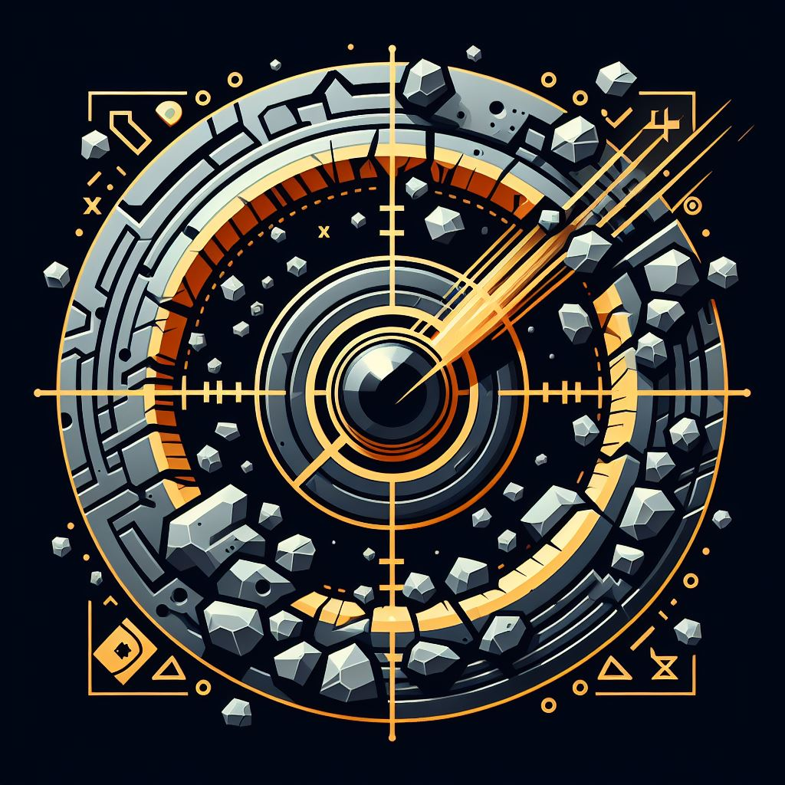

<div align="center"></div>

<div align="center">
    <h2>XHole Detection</h2>
    <h3>Determining the Diameter of Shot Holes to Produce Good Blast Fragmentation Results Based on Computer Vision and Machine Learning</h3>
    14th Indonesian Student Mining Competition - Hackathon
</div>

## Table of Contents
- [General Information](#general-information)
- [Team Member](#team-member)
- [Project Structure](#project-structure)
- [Prerequisites](#prerequisites)
- [How to Compile and Run the Program](#how-to-compile-and-run-the-program)
- [Main Features](#main-features)
- [Screenshots](#screenshots)

## General Information
The mining industry in Indonesia relies heavily on blasting as part of its operations, with varying frequencies at different sites. However, the high frequency and variability pose significant risks, leading to accidents like the one in 2023 where miscalculated blast hole dimensions resulted in the tragic death of 50 miners. Safety is paramount, and the success of a blast is determined by factors like rock fragmentation, which hinges on accurate blast hole sizing. The current conventional methods are not optimal and involve costly trial and error. Enter MineUp's innovation – XHole Detection, a mobile website revolutionizing blast operations. This tool, utilizing computer learning and AI, swiftly determines blast hole dimensions by inputting field data or even capturing geological structures through the camera. It not only saves substantial costs, potentially millions, but does so 90 times faster. More than a game-changer for mining, XHole Detection aligns with Sustainable Development Goals, fostering economic growth, innovation, and safe work environments. Join us in shaping a safer, more efficient, and technologically advanced mining industry with MineUp's XHole Detection!

## Team Member
MineUp Team
| Name                       | Major
| ---------------------------| -----------------------------|
| Michael Leon Putra Widhi   | Informatics Engineering 2021 |
| Raja Parmonang Manurung    | Mining Engineering 2021      |
| Intan Nurhaliza            | Management 2021              |

## Project Structure
```bash
.
├─── assets
├─── config
├─── data
│   └─── rock_data.csv
├─── lib
│   ├─── algorithm
│   │   ├─── Cost_Calculation.py
│   │   ├─── KuzRam_Fragmentation.py
│   │   ├─── main.py
│   │   ├─── Rock_Factor.py
│   │   └─── Rossin_Ramler.py
│   ├─── constant.py
│   ├─── framegenerator.py
│   ├─── migrate.py
│   └─── objectdetector.py
├─── static
│   ├─── images
│   │   ├─── logo.png
│   │   └─── plot.png
│   ├─── scripts
│   │   ├─── recommend.js
│   │   └─── script.js
│   └─── styles
│       ├─── detector.css
│       ├─── recommend.css
│       ├─── result.css
│       └─── style.css
├─── templates
│   ├─── components
│   │   └─── navbar.html
│   ├─── detector.html
│   ├─── index.html
│   ├─── recommend.html
│   └─── result.html
├─── xhole (virtual environment)
├─── .env
├─── .env.example
├─── .gitignore
├─── app.py
├─── LISENCE
├─── README.md
├─── requirements.txt
└─── vercel.json
```

## Prerequisites
- Python (this app is developed under ver 12.0)
- Flask (ver 3.0.0)
- matplotlib (ver 3.8.2)
- numpy (ver 1.26.3)
- opencv-python (ver 4.9.0.80)
- pillow (ver 10.2.0)
- pymongo (ver 4.6.1)
- and many more. please check this [requirements](https://github.com/mikeleo03/XHole-Detection/blob/main/requirements.txt)

## How to Compile and Run the Program
1. Clone this repository from terminal with this command
    ``` bash
    $ git clone https://github.com/mikeleo03/XHole-Detection.git
    ```
2. Install the requirements needed to run the program using package installer, pip, with this command
   ``` bash
    $ pip install -r requirements.txt
   ```
3. Run the application using this available script
   ``` bash
    $ pyhon app.py
   ```
If you do it correctly, the pogram should be running on localhost:5000.
### Run the application on production-ready environment
Make sure you have installed module named `flask_ngrok` and have `ngrok` on your laptop/PC. You can follow [this guide](https://ngrok.com/docs/getting-started/) for further explanation. <br>
After that, you could run the program using this script
``` bash
    $ ngrok http 5000
```
or this script
``` bash
    $ ngrok http --domain=[domain name] 5000
```
with `[domain name]` replaced by your personal domain or using free ngrok domain. <br>
p.s. Currently the website can only be run in the mobile version.

## Main Features
1. XHole Detection has a camera feature equipped with machine learning technology to recognize objects and distance values between joints. This feature can provide a shadow of the physical orientation based on the image captured by the camera, and gives users the freedom to analyze camera results that are considered the most accurate for use in the recommendation system.
2. After entering the camera results into the recommendation system, the application will also enter the camera measurement results as reference material. Then the application will provide various best recommendations covering rock quality to Rossin-Ramler values.
3. After providing recommendations, the application will provide complete and comprehensive blasting analysis results with the recommended blast hole diameter. Apart from that, the application will also display a graph of the Rossin distribution of rock fragmentation results and provide recommendations for action to produce better fragmentation measurements.

## Screenshots

